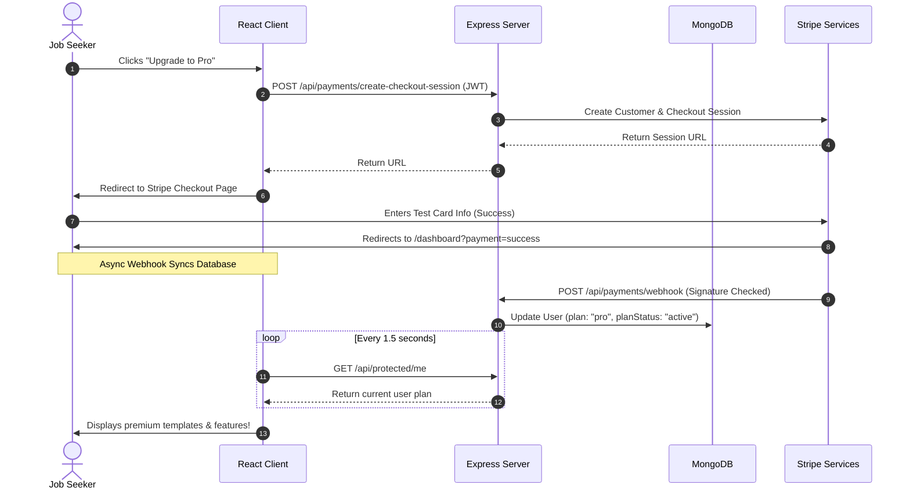

# CareerForge Pro — Mid Review Preparation Guide

This document is prepared to assist you in your **Mid Review** presentation. It compiles the current progress, technical architecture, source code status, demonstration workflows, and development highlights for **CareerForge Pro**.

---

## 1. Project Overview & Value Proposition

**CareerForge Pro** is an AI-powered resume building and optimization platform designed to elevate job seekers' applications. By combining custom-designed resume templates, instant ATS scoring, generative AI content refinement, and subscription-gated premium tools, the platform provides a comprehensive sandbox for creating and managing professional resumes.

### Key Value Pillars:
*   **AI-Enhanced Building**: Integrated with Google's **Gemini 2.5 Flash** model to parse PDF resumes, rewrite bullet points, suggest relevant skills, analyze job descriptions, and write custom cover letters.
*   **Version Control**: Full snapshotting mechanism allowing users to save discrete versions of their resumes and easily roll back changes.
*   **Feature Gating**: Multi-tiered user access structure (Free vs. Pro). Free users can build one resume and use basic AI helpers; Pro users unlock unlimited resumes, cover letters, deeper JD analysis, and A4 PDF exports.
*   **Production Billing**: Managed securely using **Stripe Checkout** and synced via robust **Stripe Webhooks** with MongoDB.

---

## 2. Technical Stack

```
                     ┌──────────────────────────────┐
                     │         REACT CLIENT         │
                     │  (Vite, Redux Toolkit, CSS)  │
                     └──────────────┬───────────────┘
                                    │
                                    │ HTTP / JWT
                                    ▼
                     ┌──────────────────────────────┐
                     │     EXPRESS API SERVER       │
                     └──────┬───────┬────────┬──────┘
                            │       │        │
                 Mongoose   │       │        │  Generative-AI SDK
          ┌─────────────────┘       │        └───────────────────┐
          ▼                         ▼                            ▼
┌──────────────────┐      ┌──────────────────┐         ┌──────────────────┐
│  MONGODB ATLAS   │      │    STRIPE API    │         │    GEMINI API    │
│  (Data Storage)  │      │ (Payments & Web) │         │ (AI Optimization)│
└──────────────────┘      └──────────────────┘         └──────────────────┘
```

*   **Frontend**: React 19, Redux Toolkit, React Router DOM v7, React Hot Toast, and Vite.
*   **Backend**: Node.js & Express.js, Mongoose (MongoDB).
*   **AI Integration**: `@google/generative-ai` SDK (`gemini-2.5-flash` model).
*   **Payment & Subscriptions**: Stripe API & Webhook handler (with signature verification).
*   **PDF Generation**: Headless Puppeteer for high-fidelity A4 layout rendering.

---

## 3. System Architecture & Workflows

### Subscription & Feature Gating Lifecycle (Stripe)

The following sequence details how subscriptions are processed and verified using Stripe Checkouts and Webhooks:



---

## 4. Feature Implementation & Progress Checklist

Below is the status of the core features implemented so far:

| Module | Features & API Endpoints | Status | Access Level | Description |
|---|---|---|---|---|
| **Auth** | POST `/api/auth/register`<br>POST `/api/auth/login`<br>GET `/api/protected/me` | ✅ Complete | Public / JWT | JWT-based auth, secure password hashing using bcrypt. |
| **Resumes** | POST `/api/resumes`<br>GET `/api/resumes`<br>PUT `/api/resumes/:id`<br>DELETE `/api/resumes/:id` | ✅ Complete | JWT (Owner) | Full CRUD actions. Starter plan is restricted to **1 resume**, while Pro is unlimited. |
| **Version History** | POST `/api/resumes/:id/versions`<br>GET `/api/resumes/:id/versions`<br>POST `/api/resumes/:id/versions/:vId/restore` | ✅ Complete | JWT (Owner) | Snapshots resume state. Restores fields instantly with automatic schema sync. |
| **PDF Export** | POST `/api/resumes/export/pdf` | ✅ Complete | Pro | Headless Puppeteer renders print-safe A4 PDF using selected templates. |
| **Basic AI** | POST `/api/ai/improve-summary`<br>POST `/api/ai/suggest-skills`<br>POST `/api/ai/ats-analysis` | ✅ Complete | Free & Pro | Summarization, skill validation, and keyword matching against job descriptions. |
| **Pro AI** | POST `/api/ai/parse-resume` (PDF Parse)<br>POST `/api/ai/analyze-jd`<br>POST `/api/ai/rewrite-bullet`<br>POST `/api/ai/generate-cover-letter` | ✅ Complete | Pro-Only | Parses PDF uploads, extracts skills, generates tailored cover letters, and rewrites bullet points. |
| **Billing** | POST `/api/payments/create-checkout-session`<br>POST `/api/payments/billing-portal`<br>POST `/api/payments/webhook` | ✅ Complete | JWT / Stripe Signature | Stripe Checkout & billing portal integration with multi-event webhook verification. |

---

## 5. Development Challenges Faced & Solutions

During the development cycle, several critical challenges were addressed:

1.  **Stripe Webhook Body Verification**:
    *   *Challenge*: Stripe signature verification requires the raw request payload (`Buffer`), but Express by default parses incoming payloads as JSON via `express.json()`.
    *   *Solution*: Mounted the webhook route `app.post('/api/payments/webhook', express.raw({ type: 'application/json' }))` **before** the `app.use(express.json())` middleware.
2.  **Structuring AI JSON Outputs**:
    *   *Challenge*: Generative LLMs sometimes respond with markdown code fences (e.g. ` ```json ... ``` `) or trailing comments, causing standard `JSON.parse` to crash.
    *   *Solution*: Created a robust `generateJSON` wrapper in [geminiService.js](file:///Users/preranapradeep/Desktop/Internship%20/Zaalima/CareerForge-Pro--main/server/services/geminiService.js) that strips markdown blocks and extracts JSON bounds if necessary.
3.  **PDF Compilation Consistency**:
    *   *Challenge*: Rendering HTML template to PDF via Puppeteer can cause pages to break incorrectly, spilling contents onto a second page.
    *   *Solution*: Set strict CSS page sizes (`size: A4`) and margins in CSS, and forced Puppeteer to wait until all network assets are loaded (`waitUntil: 'networkidle0'`).

---

## 6. Local Setup & Demonstration Guide

To showcase a working demo during the mid review, follow these instructions:

### Environment Config setup

#### Server environment ([server/.env](file:///Users/preranapradeep/Desktop/Internship%20/Zaalima/CareerForge-Pro--main/server/.env))
```bash
PORT=5001
MONGO_URI=mongodb://localhost:27017/careerforge
JWT_SECRET=your_jwt_signing_secret_key

# Google Gemini API
GEMINI_API_KEY=AIzaSy...

# Stripe Payment Configs
STRIPE_SECRET_KEY=sk_test_...
STRIPE_WEBHOOK_SECRET=whsec_...
STRIPE_PRO_PRICE_ID=price_...

CLIENT_URL=http://localhost:5173
```

#### Client environment ([client/.env](file:///Users/preranapradeep/Desktop/Internship%20/Zaalima/CareerForge-Pro--main/client/.env))
```bash
VITE_API_BASE_URL=http://localhost:5001/api
```

### Starting the Applications

1.  **Launch Database**: Start your local MongoDB server (or ensure MongoDB Atlas is connected).
2.  **Start Stripe Webhook Forwarding (in a separate terminal)**:
    ```bash
    stripe listen --forward-to localhost:5001/api/payments/webhook
    ```
    *Note: Copy the `whsec_...` secret printed in the console and place it into `server/.env` under `STRIPE_WEBHOOK_SECRET`.*
3.  **Run Server**:
    ```bash
    cd server
    npm install
    npm run dev
    ```
4.  **Run Client**:
    ```bash
    cd client
    npm install
    npm run dev
    ```
5.  **Open browser** to `http://localhost:5173`.

### Standard Demo Script:
1.  **Register a New Account**: Go through the sign-up page. Note that the dashboard starts on the "Free Plan" (Starter).
2.  **Test Free Limits**: Create a resume and save it. Try to create a second resume — a premium upgrade modal will appear.
3.  **Use Basic AI Tools**: Generate a summary optimization or view your ATS Score.
4.  **Upgrade Account**: Click "Upgrade to Pro", fill out the Stripe Checkout using the test card (`4242 4242 4242 4242`), and submit.
5.  **Verification**: You will be redirected back to the app with a success alert, and within a few seconds, the Stripe Webhook will fire, updating your dashboard plan status to "Pro".
6.  **Use Premium Tools**: Create another resume, select a premium styling template (e.g. Modern or Executive), write a cover letter, analyze a job description, and export the resume to a clean A4 PDF.
7.  **Manage Subscriptions**: Click on the Billing Portal option in Settings to verify you can cancel/update subscriptions directly on Stripe.
