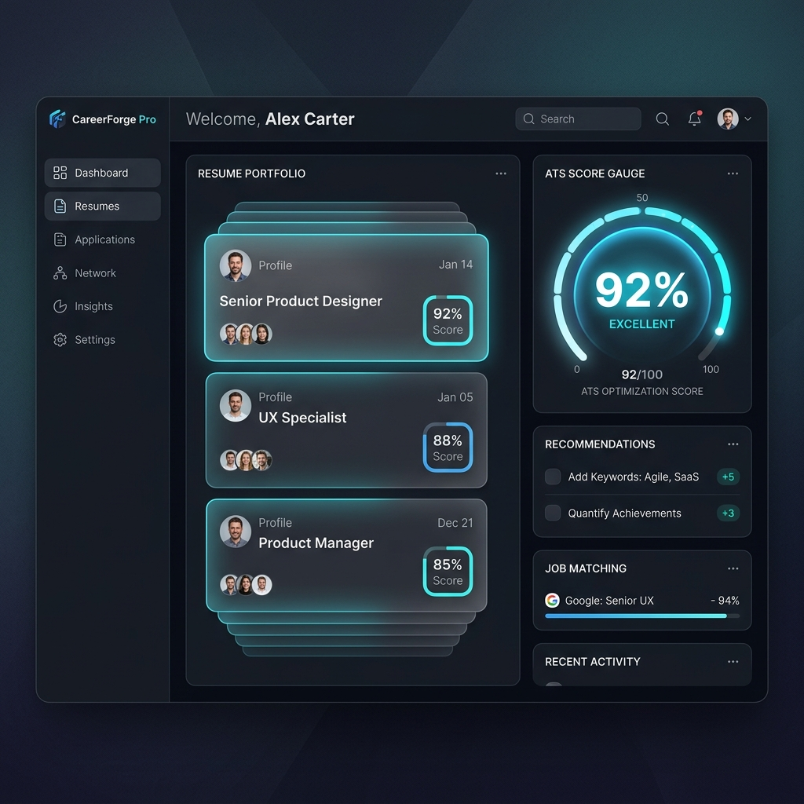
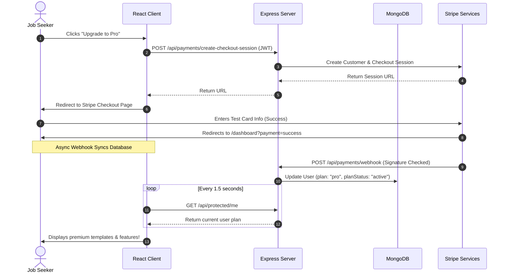

# CareerForge Pro — AI-Powered Resume & Career Command Center

CareerForge Pro is a premium, state-of-the-art SaaS platform designed to automate and optimize the modern job application pipeline. Featuring interactive builder controls, live-scaling resume template previews, instant ATS optimization, and AI cover letter generation, the application functions as a job seeker's command center.



---

## ✦ Core Value Pillars

1. **Dashboard Command Center**: Log in to an interactive command center displaying live user metrics (Highest ATS score, Resumes created, Active subscription plan) alongside a grid of resumes and an activity/suggestions timeline.
2. **AI-Enhanced Resume Builder**: Create resumes using a live-updating builder. Shift designs instantly between classic, modern, and minimal layouts, and parse existing PDF documents via Gemini AI.
3. **ATS Scoring & Keyword Matching**: Paste target job descriptions to run a local matching algorithm that parses hard/soft skills, action verbs, and keyword frequency to calculate alignment and flag missing phrases.
4. **AI-Tailored Cover Letters**: Instantly generate detailed cover letter drafts by matching resume achievements against target job descriptions. Refine text in an inline modal editor.
5. **Snapshot Version Control**: Save snapshots of resumes before testing new descriptions or layouts. Roll back or delete versions with full data recovery.
6. **Multi-Tiered Feature Gating**: Differentiates Starter (Free) users from Pro subscribers. Free users are restricted to 1 resume and basic templates; Pro users get unlimited resumes, premium layout components, cover letters, and high-fidelity PDF exports.
7. **Secure Stripe Payment Flow**: Automated payments using Stripe Checkout and Stripe billing portals, synchronized in real-time to MongoDB Atlas via secure webhooks.

---

## ⚙️ Technical Stack

- **Frontend Client**: React 19, Redux Toolkit (state management), React Router DOM v7 (routing), React Hot Toast, Vite bundler.
- **Backend API**: Node.js, Express.js.
- **Database**: MongoDB Atlas via Mongoose.
- **Generative AI**: `@google/generative-ai` SDK (`gemini-2.5-flash` model).
- **Payment Processing**: Stripe Node SDK & webhook signatures.
- **PDF Compilation**: Headless Puppeteer engine printing print-safe A4 grids.

---

## 📊 System Architecture & Data Workflows

```
                     ┌──────────────────────────────┐
                     │         REACT CLIENT         │
                     │  (Vite, Redux Toolkit, CSS)  │
                     └──────────────┬───────────────┘
                                    │
                                    │ HTTP / JWT Auth
                                    ▼
                     ┌──────────────────────────────┐
                     │     EXPRESS API SERVER       │
                     └──────┬───────┬────────┬──────┘
                            │       │        │
                  Mongoose  │       │        │ Generative-AI SDK
           ┌────────────────┘       │        └───────────────────┐
           ▼                        ▼                            ▼
 ┌──────────────────┐      ┌──────────────────┐         ┌──────────────────┐
 │  MONGODB ATLAS   │      │    STRIPE API    │         │    GEMINI API    │
 │ (Resume Data &   │      │ (Subscriptions & │         │ (Cover Letters & │
 │   User State)    │      │  Billing Portal) │         │  Resume Parsing) │
 └──────────────────┘      └──────────────────┘         └──────────────────┘
```

### 1. Subscription & Payment Lifecycle


---

## 🛠️ Environment Variables Configuration

To run the project, define the environment variables across two config files.

### 1. Backend Config: [server/.env](file:///Users/preranapradeep/Desktop/Internship%20/Zaalima/CareerForge-Pro--main/server/.env)

Create a file named `.env` inside the `server/` directory:

```bash
PORT=5001
MONGO_URI=mongodb+srv://<username>:<password>@cluster.mongodb.net/careerforge?retryWrites=true&w=majority
JWT_SECRET=your_jwt_signing_secret_key

# Google Gemini API Key
GEMINI_API_KEY=AIzaSy...

# Stripe Payment Configs
STRIPE_SECRET_KEY=sk_test_...
STRIPE_WEBHOOK_SECRET=whsec_...
STRIPE_PRO_PRICE_ID=price_...

# Client Base URL (Vite Dev Server)
CLIENT_URL=http://localhost:5173
```

### 2. Client Config: [client/.env](file:///Users/preranapradeep/Desktop/Internship%20/Zaalima/CareerForge-Pro--main/client/.env)

Create a file named `.env` inside the `client/` directory:

```bash
VITE_API_BASE_URL=http://localhost:5001/api
```

---

## 🚀 Local Installation & Execution

Follow these steps to launch the frontend, backend, and Stripe listeners locally.

### Step 1: Clone & Setup Backend
1. Navigate to the server folder:
   ```bash
   cd server
   ```
2. Install Node dependencies:
   ```bash
   npm install
   ```
3. Copy/configure your [server/.env](file:///Users/preranapradeep/Desktop/Internship%20/Zaalima/CareerForge-Pro--main/server/.env).

### Step 2: Set Up Stripe Webhooks
1. Open a new terminal window.
2. Direct Stripe events to your local server:
   ```bash
   stripe listen --forward-to localhost:5001/api/payments/webhook
   ```
3. Copy the webhook signing secret printed in the console (starts with `whsec_`) and insert it into `server/.env` under `STRIPE_WEBHOOK_SECRET`.

### Step 3: Run Database & Server
1. Start your local MongoDB server (or make sure MongoDB Atlas is connected).
2. Start the Express API server:
   ```bash
   npm run dev
   ```

### Step 4: Clone & Setup Client
1. Open a new terminal window.
2. Navigate to the client folder:
   ```bash
   cd client
   ```
3. Install dependencies:
   ```bash
   npm install
   ```
4. Start the Vite development bundler:
   ```bash
   npm run dev
   ```
5. Open your browser and navigate to `http://localhost:5173`.

---

## 📈 Standard User Workflow

```
User Registers/Login
        │
        ▼
Dashboard Opens (Displays skeletons during data fetch)
        │
        ▼
Create Resume (Choose template layout)
        │
        ▼
Edit Resume (Personal Info, Experience, Education)
        │
        ▼
Paste JD in AI Panel
        │
        ▼
AI analyzes Job Description (Extracts skills, action verbs)
        │
        ▼
ATS Match Score calculated (baseline vs keyword matching)
        │
        ▼
AI optimizes resume bullet points (applies suggestions)
        │
        ▼
ATS score improves (dynamic recalculation)
        │
        ▼
Choose modern / minimal template aesthetics
        │
        ▼
Generate PDF (A4 Headless Puppeteer engine)
        │
        ▼
Download PDF Resume
```

---

## 📄 License & Credits

Developed as part of CareerForge Pro. Built with modern, glassmorphism-inspired custom CSS patterns, Gemini AI integrations, and Stripe secure payment hooks.
